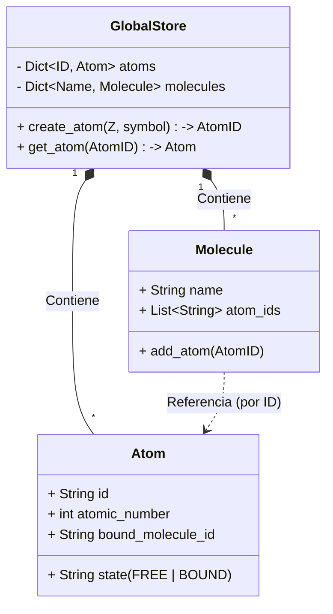
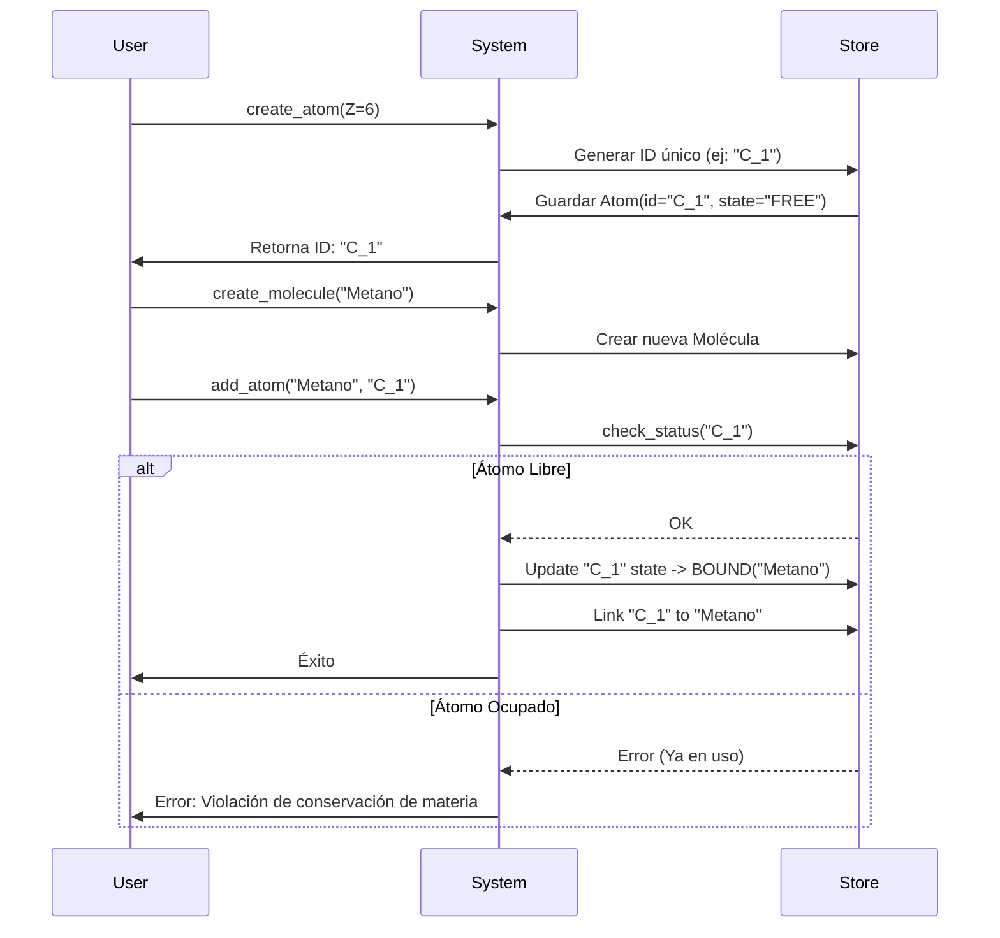

# Propuesta de Arquitectura: Registro Global de Átomos (MCP v2)

## Objetivo
Refactorizar el MCP "Miguitas" para pasar de un modelo de **Instanciación Local** a uno de **Persistencia Global**. Esto permite crear átomos independientemente de las moléculas y gestionarlos mediante IDs únicos.

## 1. Diagrama de Clases (Estructura)

## 2. Flujo de Operaciones (Sequence Diagram)

## 3. Beneficios Técnicos
1.  **Reutilización:** Permite preparar un "banco de átomos" antes de empezar experimentos.
2.  **Trazabilidad:** Cada átomo tiene identidad única. Si un experimento falla, sabes exactamente qué átomo (ID) causó el problema.
3.  **Realismo:** Impide que el mismo átomo exista en dos moléculas simultáneamente.
